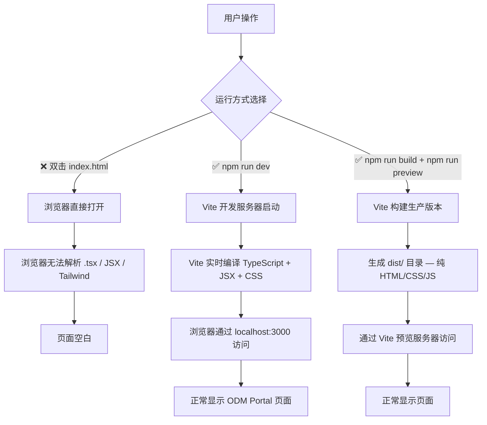

# 项目本地运行指南

## 项目是什么？

这是一个 **Vite + React + TypeScript + Tailwind CSS** 构建的现代前端项目（ODM Portal 订单管理系统），**不是一个普通的静态 HTML 项目**。

---

## 问题一：为什么直接双击打开 `index.html` 是空白的？

### 根本原因

这个项目**不能直接通过浏览器打开 `index.html` 运行**，原因如下：

| 原因 | 说明 |
|------|------|
| 🚫 **TypeScript 浏览器不支持** | [`index.html`](index.html:10) 引用了 `src/main.tsx`，但浏览器无法直接解析 `.tsx` 文件 |
| 🚫 **JSX 语法需要编译** | `src/App.tsx` 中使用了 `<App />`、`<Routes>` 等 JSX 语法，浏览器无法识别 |
| 🚫 **ES Modules 裸导入** | `import App from './App.tsx'` 这类裸模块导入需要构建工具处理 |
| 🚫 **Tailwind CSS 需要编译** | [`src/index.css`](src/index.css:1) 中的 `@import "tailwindcss"` 需要 PostCSS 处理 |
| 🚫 **路径别名需要解析** | [`vite.config.ts`](vite.config.ts:16) 中配置了 `@` 路径别名，需要构建工具转换 |

**结论**：你需要使用 **Vite 开发服务器** 来运行项目，它会实时编译所有代码并提供给浏览器。

---

## 问题二：需要哪些文件才能运作？

### 必需文件（缺一不可）

**项目根目录：**
- [`package.json`](package.json) — 项目依赖和脚本
- [`vite.config.ts`](vite.config.ts) — Vite 构建配置
- [`tsconfig.json`](tsconfig.json) — TypeScript 配置
- [`index.html`](index.html) — 页面入口（由 Vite 处理）

**源代码（`src/` 目录）：**
- [`src/main.tsx`](src/main.tsx) — React 应用入口
- [`src/App.tsx`](src/App.tsx) — 主应用组件（路由配置）
- [`src/index.css`](src/index.css) — 全局样式（Tailwind）
- [`src/context/AppContext.tsx`](src/context/AppContext.tsx) — 全局状态（认证、角色）
- [`src/data/mockData.ts`](src/data/mockData.ts) — 模拟数据
- [`src/lib/utils.ts`](src/lib/utils.ts) — 工具函数
- [`src/layouts/AppLayout.tsx`](src/layouts/AppLayout.tsx) — 应用布局组件

**页面组件（`src/pages/`）：**
- [`src/pages/Login.tsx`](src/pages/Login.tsx) — 登录页
- [`src/pages/Dashboard.tsx`](src/pages/Dashboard.tsx) — 仪表盘
- [`src/pages/Orders.tsx`](src/pages/Orders.tsx) — 订单列表
- [`src/pages/OrderDetails.tsx`](src/pages/OrderDetails.tsx) — 订单详情
- [`src/pages/OrderWizard.tsx`](src/pages/OrderWizard.tsx) — 创建订单
- [`src/pages/Reports.tsx`](src/pages/Reports.tsx) — 报告
- [`src/pages/Account.tsx`](src/pages/Account.tsx) — 账户
- [`src/pages/HelpCenter.tsx`](src/pages/HelpCenter.tsx) — 帮助中心

**UI 组件：**
- [`src/components/ui/StatusBadge.tsx`](src/components/ui/StatusBadge.tsx) — 状态标签组件

**静态资源：**
- [`public/TUVlogo.svg`](public/TUVlogo.svg) — 网站 Logo

### 可选文件

| 文件 | 用途 |
|------|------|
| [`.env.example`](.env.example) | 环境变量模板 — 复制为 `.env.local` 后可配置 `GEMINI_API_KEY` |
| [`README.md`](README.md) | 项目说明文档 |
| [`.gitignore`](.gitignore) | Git 忽略规则 |
| [`metadata.json`](metadata.json) | AI Studio 元数据 |

---

## 问题三：如何正确本地运行？

### 前置条件

安装 [Node.js](https://nodejs.org/)（建议 v18 或更高版本）。

### 步骤一：安装依赖

在项目根目录打开终端，运行：

```bash
npm install
```

这会根据 [`package.json`](package.json) 安装所有依赖（React、Vite、Tailwind CSS、Recharts 等）。

### 步骤二：（可选）配置环境变量

复制环境变量模板：

```bash
copy .env.example .env.local
```

然后编辑 `.env.local`，填入 Gemini API Key（如果需要使用 AI 功能）：

```
GEMINI_API_KEY="你的Gemini_API密钥"
```

> **注意**：如果不配置此项，项目的 UI 界面仍然可以正常显示，只是 AI 相关功能可能不可用。

### 步骤三：启动开发服务器

```bash
npm run dev
```

输出类似：
```
VITE v6.x.x  ready in xxx ms
  ➜  Local:   http://localhost:3000/
```

用浏览器打开 **`http://localhost:3000`** 即可看到应用。

### 其他常用命令

| 命令 | 用途 |
|------|------|
| `npm run dev` | 启动开发服务器（热更新） |
| `npm run build` | 构建生产版本 |
| `npm run preview` | 本地预览生产构建 |
| `npm run lint` | TypeScript 类型检查 |

---

## 流程图：运行方式对比



---

## 总结

| 问题 | 答案 |
|------|------|
| ❓ `index.html` 为什么空白？ | 因为这是 Vite+React+TS 项目，**不能直接打开**，必须通过构建工具 |
| 📦 需要哪些文件？ | 所有 `src/` 下的源文件 + 配置文件，详见上方清单 |
| 🚀 如何本地运行？ | `npm install` → `npm run dev` → 打开 `http://localhost:3000` |
| 🔧 最简步骤 | 只需两行命令：`npm install` 和 `npm run dev` |

如果需要我切换到 Code 模式帮你检查依赖是否已安装并运行项目，请告诉我！
